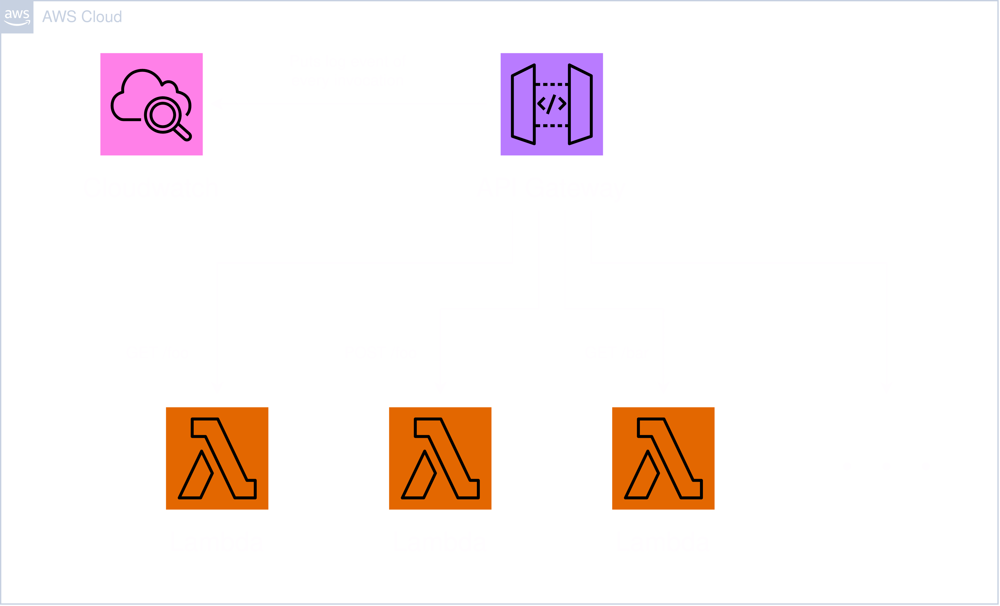

# Module: API



This module provides an API Gateway with the option to define routes which invoke Lambda functions and can be rate limited. The domain which is provided will be pointed to the API Gateway with Route53. For the domain a public hosted zone must be present in the deploying account.

## Contents

- [Requirements](#requirements)
- [Inputs](#inputs)
- [Outputs](#outputs)
- [Example](#example)
- [Contributing](#contributing)

## Requirements

| Name      | Version |
| --------- | ------- |
| terraform | >= 1.0  |
| aws       | >= 5.20 |

## Inputs

| Name        | Description                                                                 | Type           | Default | Required |
| ----------- | --------------------------------------------------------------------------- | -------------- | ------- | :------: |
| identifier  | Unique identifier to differentiate global resources.                        | `string`       | n/a     |   yes    |
| description | Short text of what the API Gateway is trying to accomplish.                 | `string`       | ""      |    no    |
| domain      | Custom domain pointed to the API Gateway.                                   | `string`       | ""      |    no    |
| routes      | A list of objects for the definition of routes in the API Gateway.          | `list(object)` | []      |    no    |
| log_config  | An object for the definition of a CloudWatch log for the API Gateway.       | `object`       | null    |    no    |
| cors_config | An object for the definition of the CORS configuration for the API Gateway. | `object`       | null    |    no    |
| tags        | A map of tags to add to all resources.                                      | `map(string)`  | {}      |    no    |

### `routes`

| Name         | Description                                                                                                              | Type     | Default | Required |
| ------------ | ------------------------------------------------------------------------------------------------------------------------ | -------- | ------- | :------: |
| route        | String of the route.                                                                                                     | `string` | n/a     |   yes    |
| method       | String of the HTTP method. Valid values: 'GET', 'POST', 'DELETE', 'PUT', 'PATCH', 'OPTIONS', 'HEAD', 'CONNECT', 'TRACE'. | `string` | n/a     |   yes    |
| function_arn | ARN of the Lambda function that will be invoked by the route.                                                            | `string` | n/a     |   yes    |
| invoke_arn   | Invoke ARN of the Lambda function that will be invoked by the route.                                                     | `string` | n/a     |   yes    |
| burst_limit  | Throttling burst limit for the route.                                                                                    | `number` | n/a     |   yes    |
| rate_limit   | Throttling rate limit for the route.                                                                                     | `number` | n/a     |   yes    |

### `log_config`

| Name              | Description                                                                                                                | Type     | Default | Required |
| ----------------- | -------------------------------------------------------------------------------------------------------------------------- | -------- | ------- | :------: |
| retention_in_days | Specifies the number of days the log events shall be retained. Valid values: 1, 3, 5, 7, 14, 30, 365 and 0 (never expire). | `number` | n/a     |   yes    |

### `cors_config`

| Name          | Description                                                                                                                | Type           | Default | Required |
| ------------- | -------------------------------------------------------------------------------------------------------------------------- | -------------- | ------- | :------: |
| allow_methods | Set of allowed HTTP methods. Valid values: 'GET', 'POST', 'DELETE', 'PUT', 'PATCH', 'OPTIONS', 'HEAD', 'CONNECT', 'TRACE'. | `list(string)` | n/a     |   yes    |
| allow_origins | Set of allowed origins.                                                                                                    | `list(string)` | n/a     |   yes    |
| allow_headers | Set of allowed HTTP headers.                                                                                               | `list(string)` | n/a     |   yes    |

## Outputs

| Name | Description                |
| ---- | -------------------------- |
| id   | The ID of the API Gateway. |

## Example

```hcl
module "api" {
  source = "github.com/custom-terraform-aws-modules/api"

  identifier  = "example-website-dev"
  description = "This API Gateway is meant to show an example."
  domain      = "api.example.com"

  routes = [
    {
      route        = "/foo"
      method       = "GET"
      function_arn = "arn:aws:lambda:test"
      invoke_arn   = "arn:aws:lambda-invoke:test"
      burst_limit  = 1000
      rate_limit   = 0.01
    },
    {
      route        = "/foo"
      method       = "DELETE"
      function_arn = "arn:aws:lambda:test"
      invoke_arn   = "arn:aws:lambda-invoke:test"
      burst_limit  = 1000
      rate_limit   = 0.01
    },
    {
      route        = "/foo"
      method       = "POST"
      function_arn = "arn:aws:lambda:test"
      invoke_arn   = "arn:aws:lambda-invoke:test"
      burst_limit  = 1000
      rate_limit   = 0.01
    }
  ]

  log_config = {
    retention_in_days = 7
  }

  cors_config = {
    allow_methods = ["GET", "POST", "DELETE"]
    allow_origins = ["example.com"]
    allow_headers = ["Content-Type", "Authorization"]
  }

  tags = {
    Project     = "example-project"
    Environment = "dev"
  }
}
```

## Contributing

In order for a seamless CI workflow copy the `pre-commit` git hook from `.github/hooks` into your local `.git/hooks`. The hook formats the terraform code automatically before each commit.

```bash
cp ./.github/hooks/pre-commit ./.git/hooks/pre-commit
```
